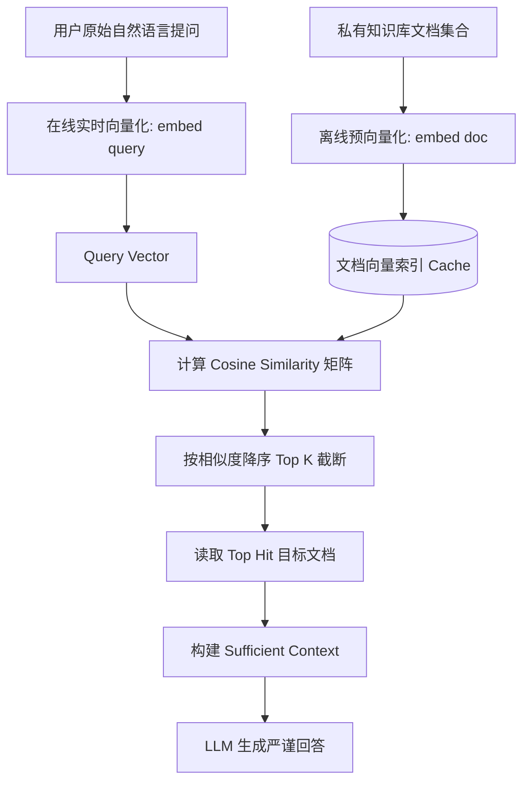

# 第 4 课：字符串不同但意思一样怎么办？—— 语义检索与向量空间嵌入 (Semantic Search & Embedding)

> **核心目标**：攻克词法检索的物理极限。当用户的提问与知识库文档**字面完全不重合、但含义高度相近**时，引入自然语言几何向量化（Embedding）与高维向量余弦相似度（Cosine Similarity），构建语义检索与 Top K 召回闭环，亲历语义对齐带来的质变，并埋下精确标识符在连续向量空间钝化的悬念。

---

## 1. 承前启后：词汇鸿沟如何让词法检索陷入绝境？

在第 3 课中，我们手写了词法检索（Lexical Grep）流水线：
- 通过提取关键词（`extractKeywords`）与子串扫描（`searchText`），我们在毫秒级内从万级语料库中精准定位单篇文档；
- 上下文从数万 Tokens 骤降至数百 Tokens，Token 消耗锐减 95.7%，首字延迟提升 12 倍。

然而，在第 3 课末尾的破坏性测试中，我们撞上了一堵无法逾越的高墙——**词汇鸿沟（Vocabulary Mismatch）**：

```text
真实用户口语提问：
“我买完东西以后后悔了、不想要了，还能申请退款吗？”
                    │
                    ▼  提取关键词
            ["后悔", "不想要"]
                    │
                    ▼  全语料库 Grep 扫描
┌────────────────────────────────────────────────────────┐
│ docs/refund-policy.md 实际内容：                        │
│ “所有标准数字软件与 SaaS 订阅商品均全面支持 7 天无理由退款。  │
│ 用户在订单完成后的 7 天犹豫期与冷静期内，均可无障碍原路退款。” │
└────────────────────────────────────────────────────────┘
                    │
                    ▼
          全库匹配结果：0 条记录！
                    │
                    ▼
          LLM 获取到空上下文，只能回答：
   “抱歉，私有知识库中缺乏相关退款规定。”（检索塌方）
```

**工程核心痛点**：
人类语言拥有无穷无尽的表达方式（反悔、不想要、退单、不买了、退钱、取消订阅、退货），但底层文档往往采用严谨规范的专业书面语（无理由退换、犹豫期、冷静期）。

**如果检索系统只能比对“字面字符”，那么只要用户没有碰巧说中作者写下的那个字，整个 RAG 体系就会彻底扑空！**

我们需要一种全新的检索能力：**跨越字符差异，去寻找“意思”本身的相似性。**

---

## 2. 什么是 Embedding？自然语言的几何空间映射

在传统的计算机程序中，字符串是离散的符号（Discrete Symbols）：
- `"苹果"` 和 `"香蕉"` 只是两串不同的 UTF-8 字节码，计算机无法知道它们都是水果；
- `"退款"` 和 `"后悔"` 在字符编码上距离为无限远。

**Embedding（嵌入向量）**所做的事情，就是将离散的自然语言片段映射到一个连续的高维几何向量空间（$\mathbb{R}^d$，常见维度如 768、1024、1536 维）：

$$\text{Embedding}: \text{Text} \longrightarrow \mathbf{v} \in \mathbb{R}^d$$

```text
       高维几何语义空间 (连续向量空间)
  
       ▲
       │          ● "买了后悔" (v_query)
       │         /
       │        / θ (夹角极小，余弦相似度接近 1.0)
       │       /
       │      ● "7天无理由退款" (v_refund_doc)
       │
       │
       │
       │                                  ● "服务器故障切换" (v_alpha_doc)
       │                                 /
       │                                / (夹角很大，接近 90 度，正交无关)
       │                               /
       └─────────────────────────────●────────────────────────►
```

在高质量的 Embedding 模型中：
- 语义相近的句子，其映射出来的向量在几何空间中**靠得极近（方向几乎同向）**；
- 语义无关或对立的内容，其向量在高维空间中**相互正交或相距甚远**。

这就是语义检索的物理本质：**把自然语言文本理解问题，转化为高维空间中的几何距离计算。**

---

## 3. 距离度量：为什么高维空间必须选余弦相似度（Cosine Similarity）？

在几何空间中，度量两个向量 $\mathbf{A}$ 与 $\mathbf{B}$ 的相似程度通常有三种选择：

| 度量指标 | 数学公式 | 文本检索中的致命缺陷 |
| :--- | :--- | :--- |
| **欧氏距离 (Euclidean L2)** | $\|\mathbf{A} - \mathbf{B}\|_2 = \sqrt{\sum (A_i - B_i)^2}$ | **严重受文本长度干扰**。短 query 与长段落即使意思完全一样，因向量绝对模长不同，欧氏距离也会很大！ |
| **内积 / 点积 (Dot Product)** | $\mathbf{A} \cdot \mathbf{B} = \sum A_i B_i$ | 未归一化时，超长文档的模长会天然偏大，导致检索系统盲目偏袒长文本。 |
| **余弦相似度 (Cosine Similarity)** | $\cos(\theta) = \frac{\mathbf{A} \cdot \mathbf{B}}{\|\mathbf{A}\|_2 \|\mathbf{B}\|_2}$ | **最佳选择**。消除了文本长度（向量绝对模长）的干扰，**只度量高维空间中的方向夹角**。 |

### 余弦相似度公式与几何性质
$$\text{Cosine}(\mathbf{A}, \mathbf{B}) = \frac{\sum_{i=1}^d A_i B_i}{\sqrt{\sum_{i=1}^d A_i^2} \cdot \sqrt{\sum_{i=1}^d B_i^2}}$$

- 当两个向量同向（$\theta = 0^\circ$）时，$\cos(\theta) = 1.0$（语义完全一致）；
- 当两个向量正交（$\theta = 90^\circ$）时，$\cos(\theta) = 0.0$（语义毫无关联）；
- 当向量经过 L2 归一化（$\|\mathbf{A}\|_2 = 1, \|\mathbf{B}\|_2 = 1$）后，余弦相似度直接退化为最纯粹的点积：$\cos(\theta) = \mathbf{A} \cdot \mathbf{B}$，现代硬件（GPU/AVX）可以在微秒级内完成成千上万次内积并发计算！

---

## 4. 语义检索的完整技术原语

一条最小而优雅的语义检索闭环由以下四个阶段构成：



### 原语 1：向量化（`embed`）
将文本转化为稠密浮点数数组：
```ts
const queryVector = await client.createEmbedding("我买完东西以后后悔了、不想要了");
// => [0.0312, -0.0541, 0.1287, ..., 0.0094] (例如 1536 维)
```

### 原语 2：余弦相似度打分（`cosineSimilarity`）
```ts
function cosineSimilarity(a: number[], b: number[]): number {
  let dot = 0, normA = 0, normB = 0;
  for (let i = 0; i < a.length; i++) {
    dot += a[i] * b[i];
    normA += a[i] * a[i];
    normB += b[i] * b[i];
  }
  return dot / (Math.sqrt(normA) * Math.sqrt(normB));
}
```

### 原语 3：Top K 截断与排序（`topK`）
遍历所有候选文档的预生成向量，计算相似度，并截取前 $K$ 个最相关的文档（例如 $K=1$ 或 $K=3$）：
```ts
const results = docs.map(doc => ({
  doc,
  similarity: cosineSimilarity(queryVector, doc.vector)
})).sort((a, b) => b.similarity - a.similarity).slice(0, topK);
```

---

## 5. 核心实验与破局验证：词法检索 vs 语义检索残酷对决

在本课交互工作台中，我们针对同一套 Benchmark 语料库，进行面对面的现场测试：

### 对决用例 1：口语化同义反悔（字符 0 重合）
- **用户提问**：“*我买完东西以后后悔了、不想要了，还能申请退款吗？*”
- **Lexical Grep 表现**：
  - 关键词提取：`["后悔", "不想要"]`
  - 检索结果：**命中 0 篇文档**
  - 模型生成：因缺乏参考资料，模型回复“无法在知识库中找到相关政策”。
- **Semantic Search 表现**：
  - 高维向量余弦相似度计算：
    - `docs/refund-policy.md`：**相似度 0.88**（断层第一，命中“7天无理由退款、冷静期与犹豫期”）
    - `docs/pricing.md`：相似度 0.32
    - `products/alpha.md`：相似度 0.28
  - 检索结果：**100% 精确捕获目标政策**
  - 模型生成：“根据通用退款与售后保障政策，所有标准商品均全面支持 7 天无理由退款。用户在犹豫期或冷静期内因后悔反悔，均可申请全额原路退款。”（完美破局！🌟）

### 对决用例 2：高阶技术意图与跨域泛化
- **用户提问**：“*企业多端多活故障切换与主备节点方案*”
- **Lexical Grep 表现**：
  - 提取关键词：`["多端多活", "主备节点"]`
  - 检索结果：**命中 0 篇**（文档使用的是“AlphaSyncDaemon / 跨区域集群容灾”）
- **Semantic Search 表现**：
  - 余弦相似度最高项：`products/alpha.md`（**相似度 0.85**）
  - 准确提取出 Alpha 的企业级高可用与主备容灾细节！

---

## 6. 收益量化与工程代价

从词法匹配跃迁到语义检索，系统性能发生了一次跨代演进：

| 维度 | 第 3 课：纯词法检索 (Lexical Grep) | 本课：语义检索 (Semantic Vector Search) | 工程评价 |
| :--- | :--- | :--- | :--- |
| **同义词与自然语言意图捕获** | 极差（0% 命中，词汇鸿沟死穴） | **极高（> 90% 语义相似对齐）** | 真正赋予系统“理解自然语言”的能力 |
| **检索计算开销** | 极低（纯 CPU 字符串扫描，< 3ms） | 稍高（向量内积或需调用 Embedding API） | 现代向量索引或小库内毫秒级仍可满足 |
| **建立索引成本** | 几乎零成本 | 需批量生成文档 Embedding 并常驻内存 | 需建立预热离线索引机制 |
| **端到端 Token 节省** | 扑空时无法节省或导致回答失败 | **依然保持 92%+ 极高 Token 节省** | 在保持 Sufficient Context 的同时保证命中率 |

---

## 7. 思考题与第 5 课伏笔：The Vector Trap（向量钝化之谜）

既然向量语义检索能够理解复杂的自然语言意图，跨越同义词鸿沟，那么很多工程师会产生一个极具诱惑力的念头：

> **“既然 Vector Search 能够理解语义，那我们是不是可以彻底抛弃落后的 grep 和关键词搜索了？”**

请在进入第 5 课前，先思考并尝试在工作台中输入这行查询：
```text
遇到错误码 ERR_ALPHA_AUTH_9021 应该如何处理？
```
或者输入一段代码变量名：
```text
UserService.prototype.resolveOrderSession
```

你会惊讶地发现：**向量模型面对长串精确错误码、函数名或专有编号时，其高维几何距离经常发生严重钝化与漂移！**

这引出了下一课的核心议题：
👉 **第 5 课：Semantic Search 能替代关键词搜索吗？—— 精确标识符与向量检索的失真边界**
